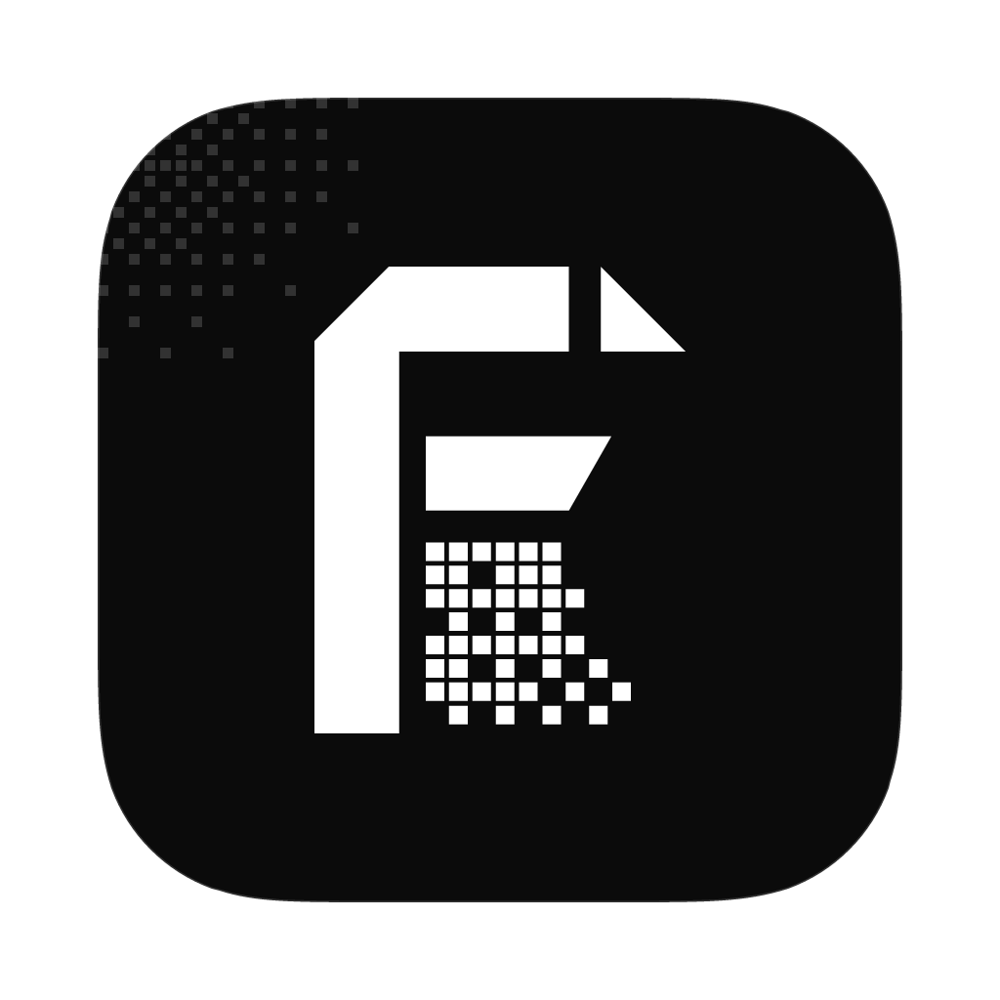

<p align="center">
  
</p>
<p align="center">
  <a href="https://lsuite.xyz/folio">Website</a> ·
  <a href="https://github.com/ludovic111/folio/releases/latest">Download</a> ·
  <a href="https://lsuite.xyz/folio/support">Sponsor</a>
</p>

<h1 align="center">folio</h1>

<p align="center"><strong>Documents, sheets and slides in one file.</strong> (beta)<br/>
Native Rust app (GPUI) · opens and writes Word, Excel, PowerPoint and OpenDocument · drivable by your AI (MCP, CLI, built-in agent).<br/>
Part of <a href="https://lsuite.xyz">lsuite</a>, the free, open-source creative suite your AI can drive.</p>

---

folio is an office app built on one idea: a file holds any mix of **documents** (rich text on
pages), **sheets** (a grid with formulas) and **decks** (slides), and they work together. A table in
a report or a chart on a slide can show a sheet's range **live**: change a number in the sheet and
the report and the slides follow.

Coming from Microsoft Office, Google Workspace, Apple iWork or LibreOffice? folio opens `.docx`,
`.xlsx` and `.pptx` (what Google's apps download and what Pages, Numbers and Keynote export),
`.odt`, `.ods`, `.odp`, CSV and Markdown, and exports PDF, Office, OpenDocument, CSV, Markdown and
HTML. The look is lsuite's design system v2: black and white, square, with film grain behind the
chrome; the paper stays white.

## What it does

**Documents**
- Pages laid out exactly as they print (the window and the PDF share one layout engine)
- Paragraph styles (title, subtitle, three heading levels, quote, code, caption), bold, italic, underline, strikethrough, colour, highlight, size and font
- Bulleted, numbered and check lists with levels; alignment and justification
- Tables (Tab moves between cells and adds rows), pictures with captions, page breaks
- Page size and orientation, margins, headers and footers with page numbers
- Footnotes, comments with replies, tracked changes you accept or reject

**Sheets**
- A formula engine with references, ranges, other sheets (`'Raw data'!B2`), recalculation by dependencies and about 150 functions: SUM, AVERAGE, IF, IFS, VLOOKUP, XLOOKUP, INDEX, MATCH, COUNTIF(S), SUMIF(S), TEXT, DATE, EDATE, PMT, NPV…
- Number formats (currency, percent, dates, scientific…), bold, colours, fills, borders, alignment, wrap
- Sort, filter, fill down and right (series continue, formulas move their references), AutoSum
- Freeze the header, resize columns and rows, charts that sit over the grid

**Decks**
- Slide layouts (title, title and content, section, two columns, title only, blank) and themes
- Text boxes, rectangles, ellipses, triangles, lines and arrows; pictures; tables and charts
- Move and resize on the slide, speaker notes, hidden slides
- Present full screen, or with the presenter view (next slide, notes, clock)

**One file**
- Live tables and charts from any sheet range, in documents and on slides
- One undo history for everything, whoever made the change (you, the agent, a script)
- Saves itself; `.folio` is a zip of JSON and pictures ([docs/FILE_FORMAT.md](docs/FILE_FORMAT.md))

## Drive it from AI and scripts

Everything you can do in the window is a named command (`doc.write`, `sheet.setRange`,
`deck.addSlide`…, see [docs/COMMANDS.md](docs/COMMANDS.md)), and the window, the built-in agent,
`folio-cli` and `folio-mcp` all go through the same registry and share one undo history.

```bash
claude mcp add folio -- /Applications/folio.app/Contents/MacOS/folio-mcp --live    # Claude Code
folio-cli file.overview                                                             # the running app
folio-cli --file plan.folio doc.write --markdown "# Plan\n\nShip on **Friday**."    # a file
folio-cli convert report.docx report.pdf
```

The **Agent** panel (⌘J) runs **lsuite AI** with no setup once you sign in, or the model you
already have: Claude Code, Codex, an Anthropic, OpenAI, OpenRouter or Mistral key, or a local model
(Ollama, LM Studio). Ask it for a **plugin** and it writes a spreadsheet function in Rust with
folio's SDK, builds it and installs it. Details: [docs/AI_CONTROL.md](docs/AI_CONTROL.md).

## Architecture

```
crates/
  folio-calc      formula engine: parser, functions, number formats, dependency graph
  folio-core      the model: documents, sheets, decks, live links, one undo history, the .folio file
  folio-layout    text layout and pagination (cosmic-text), slide text, chart geometry, rasters
  folio-io        DOCX, XLSX, PPTX, ODF, CSV, Markdown, HTML and PDF
  folio-control   the command registry, session, permissions, loopback bridge, lsuite discovery and AI account, plugins
  folio-agent     the built-in agent
  folio-plugin    the plugin SDK (spreadsheet functions behind a frozen C ABI)
  folio-desktop   the window (GPUI), binary `folio`
  folio-cli       `folio-cli`: any command, on the running app or a file
  folio-mcp       `folio-mcp`: the registry as MCP tools (`--live`, `--file`)
```

## Build

Rust 1.92 or later.

```bash
cargo run -p folio                      # the window
cargo run -p folio-cli -- --help
scripts/bundle-macos.sh                 # folio.app and a .dmg (on a Mac)
```

## License

MIT. Fonts: IBM Plex and Chakra Petch (SIL Open Font License). Icons: Lucide (ISC). Other apps'
logos belong to their owners (`crates/folio-desktop/assets/logos/SOURCES.md`).
